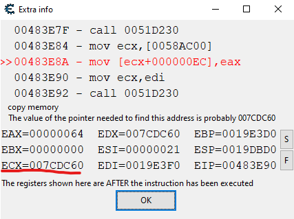

<h1>Internal Cheats</h1>

## `✋` IMPORTANT
> **Warning**: *The code in this repo is explicitly for educational purposes. I am not responsible for anything that happens when you use this software. *

This repository was created to archive and document all of my attempts to learn and develop cheats. This is a beginner friendly guide. 

- `🟢` Infinite Health 
- `🟢` Radar

## `📚` PREREQUISITES
In order to effectively follow this guide, it is necessary to possess prior experience in C++, Assembly and a comprehensive understanding of computer memory concepts.

# Cheat Engine and Offsets
Before writing any code, we need to reverse engineer the game. To do so, we will use [Cheat Engine](https://cheatengine.org/). With this tool, we will be able to inspect the game memory and use the disassembler to read the assembly code.

<h2>Finding player pointer</h2>
For the first step, we will try to find the health of our player. After scanning some values, we get 2 different value. One of them is for the value displayed and the other one is the actual health.

<p align="center" width="100%">
    
</p>

After giving myself some damage in game, I can find which one of those two is the value for my actual health. 
Now in order to find the pointer to our player, we need to take a look at what is accessing this adress.

<p align="center" width="100%">
    
</p>

Take some damage in game and you will see a bunch of Assembly code appear on the cheat engine window. 

```c
0045E3EB - 8B 8B EC000000  - mov ecx,[ebx+000000EC]
00461628 - FF B7 EC000000  - push [edi+000000EC]
00484499 - 89 82 EC000000  - mov [edx+000000EC],eax
00483E8A - 89 81 EC000000  - mov [ecx+000000EC],eax
```
In this code, we can see `[ecx+000000EC]`. So it's fine to assume that the offset of the health is 0xEC. We can also assume that the register `ECX` contains the adress of the player. So basically, we are moving `EAX` (new health value) to the adress `ecx+000000EC`.

Another interesting thing is that the value of the register `ECX` is `0x007CDC60` as we can see here: 

<p align="center" width="100%">
    
</p>

We will now try to find the static pointer to that adress by scanning for 4 bytes Hexadecimal values. We are also looking for the adress that are in green because it means that they are static adress. (They will be the same even when we restart the game) 

<p align="center" width="100%">
    
</p>

To find which one is the right one, we will have to try them all out. To do so, we can click on `Add Adress Manually` and then `pointers`. Finaly, we can find that the offset to get our local player is `0x195404`.

<h2>Finding entity list</h2>
To find an entity list (All the other players in the same game as us), we can use the same thing but when we are looking at the disassembler, we will need to search for a line that looks like this 

```c++
ac_client.exe+81AE6 - 8B 0C B3  - mov ecx,[ebx+esi*4]
```
This is the equivalent of a loop where esi would be `i` and `ebx` is the base adress of our list. We do `*4` because an adress is 4 bytes. 


# Using offsets 
Offsets in the context of computer memory refer to the distances between the starting points of different memory locations. 
Each memory location has a unique address, and the offset represents the difference between the address of a specific memory location and the reference point, often the starting address.

Offsets are commonly used to access and manipulate data in computer memory. By adding an offset value to a base memory address we can access an attribute of a struct/class. 

To better understand, let's look at an example. 

```c++
struct player {
    int health; // offset: 0x0
    int shield; // offset: 0x4
    float x;    // offset: 0x8
    float y;    // offset: 0xC
    float z;    // offset: 0x10
}

player* myPlayer = new player{100, 0, 1, 2, 3}; 
```
In this example, we have a pointer to a player. In a software like [Cheat Engine](https://cheatengine.org/) we can find the static pointer value which often looks like `ac_client.exe + 0x195404`, where `ac_client.exe` is the base adress of the executable and `0x195404` is the offset to get the local player. You can then simply add the offset to any attribute of the struct to get the value you want. In C++, the code to access the value looks like this: 

```c++
DWORD_PTR GetExecutableBaseAddress()
{
    HMODULE hModule = GetModuleHandleA("ac_client.exe");  
    return (DWORD_PTR)hModule;
}

void findMyPlayer() {
    DWORD_PTR baseAddress = GetExecutableBaseAddress();
    auto localPlayer = reinterpret_cast<std::uintptr_t*>(baseAddress + offsets::dwLocalPlayer);
    myPlayer = new playerObject{
        reinterpret_cast<int*>(*localPlayer + offsets::pHealth),
        reinterpret_cast<float*>(*localPlayer + offsets::pSouthNorth),
        reinterpret_cast<float*>(*localPlayer + offsets::pWestEast),
        reinterpret_cast<char*>(*localPlayer + offsets::pName),
        reinterpret_cast<float*>(*localPlayer + offsets::viewAngle)
    };
}
```
Once you have all the attribute you want, it's good to create a custom struct to store the entity. 

```c++
struct playerObject {
    int* health;
    float* southPos;
    float* westPos;
    char* name;
    float* viewAngle; 

    std::string getPlayerDetails() {
        std::stringstream ss;
        ss << "Name: " << name << "\n";
        ss << "Health: " << std::to_string(*health) << "\n";
        ss << "South-North Position: " << std::to_string(*southPos) << "\n";
        ss << "West-East Position: " << std::to_string(*westPos) << "\n";
        return ss.str();
    }
};
```

# Radar 

Now that we are able to read and modify the game, making an interface becomes easy. To do so you can use [ImGUI](https://github.com/ocornut/imgui), [OpenGL](https://www.opengl.org/) or [Win32 API](https://learn.microsoft.com/en-us/windows/win32/). For my radar, I used Win32. The code for this can be found in UI.h and this is the result. 

<iframe src="https://giphy.com/embed/hSjLzueofjE0Net8dZ" width="480" height="360" frameBorder="0" class="giphy-embed" allowFullScreen></iframe><p><a href="https://giphy.com/gifs/hSjLzueofjE0Net8dZ">via GIPHY</a></p>

# DLL Injection 

It's important to know the difference between an Internal and External Cheat. Internal cheats are built into the game or software, exploiting code vulnerabilities to provide advantages. They are complex to develop but offer extensive cheating capabilities. External cheats are separate programs that run alongside the game, modifying memory or input/output. They are easier to develop but more prone to detection.

In games without Anti-Cheat, you can use [Process Hacker](https://processhacker.sourceforge.io/downloads.php) to inject your DLL and it won't get detected. However, most competitive game use strong anti-cheats which makes it really hard to not get detected. 

### Legal 
This is purely educational content. If you wish to experiment, please do so in offline games or against bots. Do not spoil the experience for other players. This project does not contain any Assault Cube intellectual property and is not affiliated with it in any manner. The original game is necessary and can be obtained from: https://assault.cubers.net/


